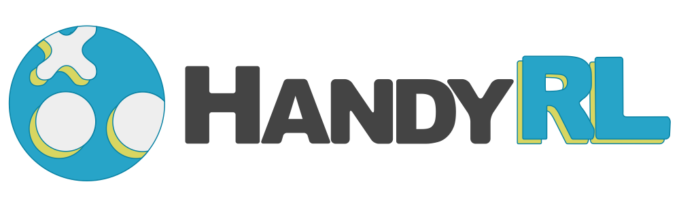

**Quick to Start, Easy to Win**
* Prepare your own environment
* Let’s start large-scale distributed reinforcement learning
* Get your strong AI agent!

HandyRL is a handy and simple framework based on Python and PyTorch for distributed reinforcement learning that is applicable to your own environments. HandyRL focuses on a practicable algorithm and implementation to create a strong and winning AI in competitive games. For large scale training, HandyRL provides a controllable high parallelism power according to your environment.


* [More About HandyRL](#More-About-HandyRL)
* [Installation](#Installation)
* [Getting Started](#Getting-Started)
    * [Train AI Model for Tic-Tac-Toe](#Train-AI-Model-for-Tic-Tac-Toe)
* [Documentation](#Documentation)
    * [Config Parameters](docs/parameters.md)
    * [Large Scale Training](docs/large_scale_training.md)
    * [Train with Customized Environment](docs/custom_environment.md)
    * [API](docs/api.md)
* [Use Cases](#Use-Cases)

HandyRL is updated at the beginning of every month except for important updates. We appreciate all contributions. Please let us know if you find a bug or have a suggestion by creating an issue and a PR.

## More About HandyRL

HandyRL mainly provides **a policy gradient algorithm with off-policy correction**.
From the perspective of stability and performance, the off-policy version policy gradient works fine in practice. So it’s a good first choice to create a baseline AI model.
You can use some off-policy variants of update methods (targets of policy and value) from traditional ones (monte carlo, TD(λ)) to novel ones (V-Trace, UPGO).
These items can be changed in `config.yaml`.

As a training architecture, HandyRL adopts **a learner-worker style architecture** like IMPALA.
The learner is a brain of training which updates a model and controls the workers.
The workers have two roles. They asynchronously generate episodes (trajectories) and evaluate trained models.
In episode generation, self-play is conducted as default.


## Installation

### Install dependencies

HandyRL supports Python3.7+. At first, copy or fork HandyRL repository to your environment. If you want to use this script in your private project, just copy the files to your project directory and modify it there.
```
git clone https://github.com/DeNA/HandyRL.git
cd HandyRL
```

Then, install additional libraries (e.g. numpy, pytorch). Or run it in a virtual environment or container (e.g. Docker).
```
pip3 install -r requirements.txt
```

To use games of kaggle environments (e.g. Hungry Geese) you can install also additional dependencies.
```
pip3 install -r handyrl/envs/kaggle/requirements.txt
```


## Getting Started


### Train AI Model for Tic-Tac-Toe

This section shows the training a model for [Tic-Tac-Toe](https://en.wikipedia.org/wiki/Tic-tac-toe). Tic-Tac-Toe is a very simple game. You can play by googling "Tic-Tac-Toe".

#### Step 1: Set up configuration

Set `config.yaml` for your training configuration. When you run a training with Tic-Tac-Toe and batch size 64, set like the following:


```yaml
env_args:
    env: 'TicTacToe'

train_args:
    ...
    batch_size: 64
    ...
```

NOTE: [Here is the list of games implemented in HandyRL](handyrl/envs). All parameters are shown in [Config Parameters](docs/parameters.md).


#### Step 2: Train!

After creating the configuration, you can start training by running the following command. The trained models are saved in `models` folder every `update_episodes` described in `config.yaml`.

```
python main.py --train
```


#### Step 3: Evaluate

After training, you can evaluate the model against any models. The below code evaluate the model of epoch 1 for 100 games with 4 processes.


```
python main.py --eval models/1.pth 100 4
```

NOTE: Default opponent AI is random agent implemented in `evaluation.py`. You can change the agent with any of your agents.


## Documentation

* [**Config Parameters**](docs/parameters.md) shows a list of parameters of `config.yaml`.
* [**Large Scale Training**](docs/large_scale_training.md) is a procedure for large scale training remotely.
* [**Train with Customized Environment**](docs/custom_environment.md) explains an interface of environment to create your own game.
* [**API**](docs/api.md) shows entry-point APIs of `main.py`


## Use Cases

*   [The 1st place solution in Hungry Geese (Kaggle)](https://www.kaggle.com/c/hungry-geese/discussion/263279)
*   [The 5th place solution in Google Research Football with Manchester City F.C. (Kaggle)](https://www.kaggle.com/c/google-football/discussion/203412)
